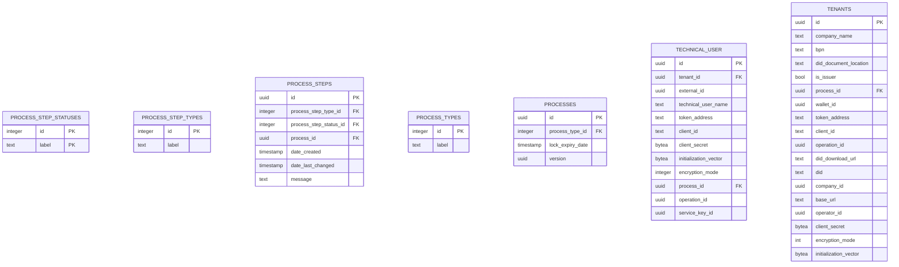

# Database View

- [Database View](#database-view)
  - [Database Overview](#database-overview)
  - [Database Structure](#database-structure)
    - [PROCESS\_STEP\_STATUSES](#process_step_statuses)
      - [Possible Values](#possible-values)
    - [PROCESS\_STEP\_TYPES](#process_step_types)
      - [Possible Values](#possible-values-1)
    - [PROCESS\_STEPS](#process_steps)
    - [PROCESS\_TYPES](#process_types)
      - [Possible Values](#possible-values-2)
    - [PROCESSES](#processes)
    - [TECHNICAL\_USER](#technical_user)
    - [TENANTS](#tenants)
    - [Enum Value Tables](#enum-value-tables)
    - [Process Handling](#process-handling)
  - [NOTICE](#notice)

## Database Overview

## Database Structure

The database is organized into several key tables, each serving a specific purpose:

### PROCESS_STEP_STATUSES

id (INTEGER): A unique identifier for the process step status. This is the primary key of the table.
label (TEXT): The label of the process step status.

#### Possible Values

- `TODO`: The process step is still to be executed.
- `DONE`: The process step was already executed successfully.
- `SKIPPED`: The execution of the process step was skipped.
- `FAILED`: The process step execution failed due to an error.
- `DUPLICATE`: The process step did already exist.

### PROCESS_STEP_TYPES

id (INTEGER): A unique identifier for the process step type. This is the primary key of the table.
label (TEXT): The label of the process step type.

#### Possible Values

- `CREATE_WALLET`: Sends the wallet creation process to the SAP Dim
- `CHECK_OPERATION`: Checks the wallet creation operation to be completed
- `GET_COMPANY`: Gets the company and wallet information
- `GET_DID_DOCUMENT`: Gets the did document and the did for the wallet
- `CREATE_STATUS_LIST`: Only if the tenant is an issuer - Creates the status list
- `SEND_CALLBACK`: Sends the wallet data back to the portal backend
- `RETRIGGER_CREATE_WALLET`: Retriggers the `CREATE_WALLET` step
- `RETRIGGER_CHECK_OPERATION`: Retriggers the `CHECK_OPERATION` step
- `RETRIGGER_GET_COMPANY`: Retriggers the `GET_COMPANY` step
- `RETRIGGER_GET_DID_DOCUMENT`: Retriggers the `GET_DID_DOCUMENT` step
- `RETRIGGER_CREATE_STATUS_LIST`: Retriggers the `CREATE_STATUS_LIST` step
- `RETRIGGER_SEND_CALLBACK`: Retriggers the `SEND_CALLBACK` step
- `CREATE_TECHNICAL_USER`: Sends a technical user creation request to the SAP Dim
- `GET_TECHNICAL_USER_DATA`: Gets the technical user data (clientId, clientSecret and tokenUrl)
- `GET_TECHNICAL_USER_SERVICE_KEY`: Gets the service key id which is needed to delete the technical user later on
- `SEND_TECHNICAL_USER_CREATION_CALLBACK`: Sends all information of the technical user to the portal backend
- `RETRIGGER_CREATE_TECHNICAL_USER`: Retriggers the `CREATE_TECHNICAL_USER` step
- `RETRIGGER_GET_TECHNICAL_USER_DATA`: Retriggers the `GET_TECHNICAL_USER_DATA` step
- `RETRIGGER_GET_TECHNICAL_USER_SERVICE_KEY`: Retriggers the `GET_TECHNICAL_USER_SERVICE_KEY` step
- `RETRIGGER_SEND_TECHNICAL_USER_CREATION_CALLBACK`: Retriggers the `SEND_TECHNICAL_USER_CREATION_CALLBACK` step
- `DELETE_TECHNICAL_USER`: Deletes the technical user from the SAP Dim
- `SEND_TECHNICAL_USER_DELETION_CALLBACK`: Sends a status of whether the deletion was successful to the portal and deletes the technical user from the database
- `RETRIGGER_DELETE_TECHNICAL_USER`: Retriggers the `DELETE_TECHNICAL_USER` step
- `RETRIGGER_SEND_TECHNICAL_USER_DELETION_CALLBACK`: Retriggers the `SEND_TECHNICAL_USER_DELETION_CALLBACK` step

### PROCESS_STEPS

id (UUID): A unique identifier for the process step. This is the primary key of the table.
process_step_type_id (INTEGER): A foreign key referencing id in the PROCESS_STEP_TYPES table.
process_step_status_id (INTEGER): A foreign key referencing id in the PROCESS_STEP_STATUSES table.
process_id (UUID): A foreign key referencing id in the PROCESSES table.
date_created (TIMESTAMP): The timestamp when the process step was created.
date_last_changed (TIMESTAMP): The timestamp when the process step was last changed.
message (TEXT): A message associated with the process step.

### PROCESS_TYPES

id (INTEGER): A unique identifier for the process type. This is the primary key of the table.
label (TEXT): The label of the process type.

#### Possible Values

- `SETUP_DIM`: Process to create wallets.
- `TECHNICAL_USER`: Process to create and delete technical users.

### PROCESSES

id (UUID): A unique identifier for the process. This is the primary key of the table.
process_type_id (INTEGER): A foreign key referencing id in the PROCESS_TYPES table.
lock_expiry_date (TIMESTAMP): The lock expiry date of the process.
version (UUID): The version of the process.

### TECHNICAL_USER

id (UUID): A unique identifier for the technical user. This is the primary key of the table
tenant_id (UUID): A unique identifier for the tenant. This is a foreign key referencing id in the TENANT table
external_id (UUID): the id of the technical user in the dim
technical_user_name (TEXT): The name of the technical user
token_address (TEXT): The address for the authentication of the technical user
client_id (TEXT): The client id which is needed for authentication
client_secret (BYTEA): The encrypted client secret
initialization_vector (BYTEA): The used initialization vector which is needed for decrypting the secret
encryption_mode (INTEGER): The used encryption mode for the secret
process_id (UUID): A unique identifier for the process. This is a foreign key referencing id in the PROCESS table
operation_id (UUID): A unique identifier of the operation which is created on SAP Dim side
service_key_id (UUID): A unique identifier of the technical user on SAP Dim side

### TENANTS

id (UUID): A unique identifier for the technical user. This is the primary key of the table
company_name (TEXT): Name of the company must be unique in combination with the bpn
bpn (TEXT): Bpn of the company must be unique in combination with the name
did_document_location (TEXT): The location of the did document (url)
is_issuer (BOOL): Defines if the requesting tenant is an issuer
process_id (UUID): A unique identifier for the process. This is a foreign key referencing id in the PROCESS table
operator_id (UUID): A unique identifier of the operator which is used for the wallet creation
did_download_url (TEXT): The url of the did document.
did (TEXT): The did of the wallet
base_url (TEXT): The address of the wallet
token_address (TEXT): The address for the authentication of the wallet
client_id (TEXT): The client id which is needed for authentication
client_secret (BYTEA): The encrypted client secret
initialization_vector (BYTEA): The used initialization vector which is needed for decrypting the secret
encryption_mode (INTEGER): The used encryption mode for the secret
company_id (UUID): A unique identifier of the company in the SAP DIM
operation_id (UUID): A unique identifier of the operation which is created in the SAP DIM
wallet_id (UUID): A unique identifier of the wallet in the SAP DIM

### Enum Value Tables

`process_step_statuses`, `process_step_types`, `process_steps`, `process_types` are tables designed to store enum values. They contain an id and label, derived from the backend enums.

### Process Handling

The tables `processes`, `process_steps` are used for the processing of the wallet creation and technical user management.

## NOTICE

This work is licensed under the [Apache-2.0](https://www.apache.org/licenses/LICENSE-2.0).

- SPDX-License-Identifier: Apache-2.0
- SPDX-FileCopyrightText: 2024 SAP SE or an SAP affiliate company, BMW Group AG and ssi-dim-middle-layer contributors
- Source URL: https://github.com/SAP/ssi-dim-middle-layer
