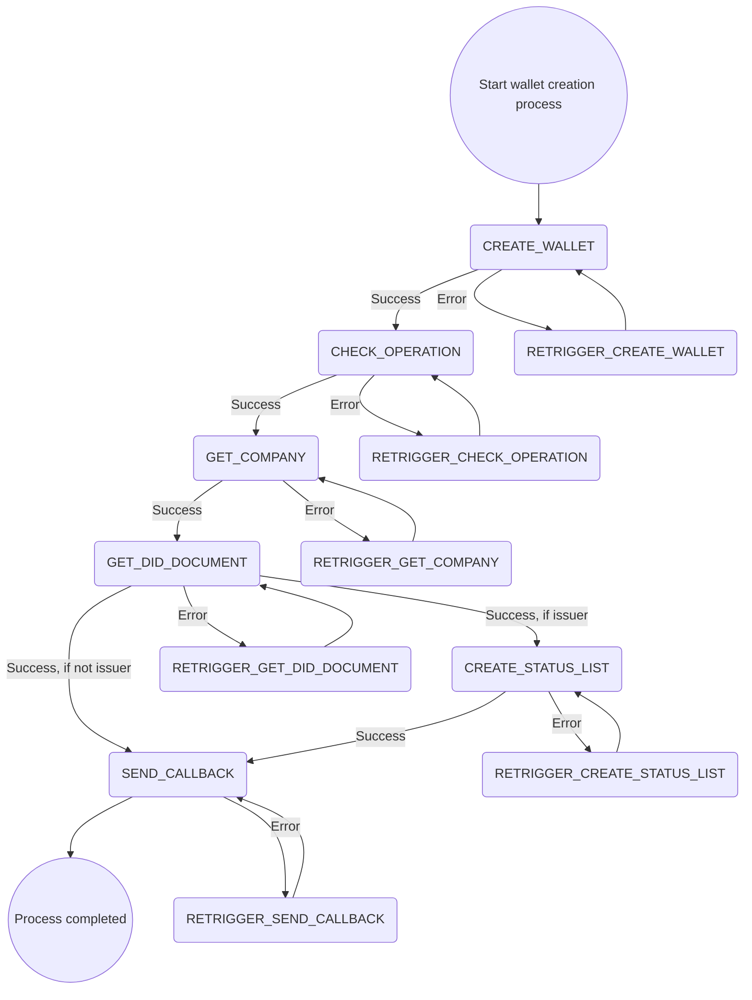

# Create Wallet Process

## Summary

The create wallet process handles the creation of a wallet. The process steps are the following:



## External dependencies

The process worker communicates with the SAP DIM to create the wallet. It further more communicates with the portal backend to return the wallet data.

## Process Steps

### CREATE_WALLET

The process step `CREATE_WALLET` is automatically triggered from the process worker. It sends a request to create the wallet to the SAP DIM.

### CHECK_OPERATION

The process step `CHECK_OPERATION` is automatically triggered from the process worker. It requests the status of the operation which is created in the `CREATE_WALLET` step. If the status is `completed` it takes the data of the wallet and saves it in the database.

### GET_COMPANY

The process step `GET_COMPANY` is automatically triggered from the process worker. It retrieves Did download url and company id and saves it to the database.

Example did document:

```json
{
  "@context":
    [
      "https://www.w3.org/ns/did/v1",
      "https://w3id.org/security/suites/jws-2020/v1",
    ],
  "id": "did:web:example.org:api:did:BPNL0000001TEST",
  "service":
    [
      {
        "type": "CredentialService",
        "serviceEndpoint": "https://dis-agent-prod.eu10.dim.cloud.sap/api/v1.0.0/iatp",
        "id": "did:web:example.org:api:did:BPNL0000001TEST#CredentialService",
      },
    ],
  "verificationMethod":
    [
      {
        "id": "did:web:example.org:api:did:BPNL0000001TEST#keys-1c55236c-f974-4c7e-bdd3-b667d0c2e1a4",
        "type": "JsonWebKey2020",
        "controller": "did:web:example.org:api:did:BPNL0000001TEST",
        "publicKeyJwk":
          {
            "kty": "EC",
            "crv": "secp256k1",
            "x": "kxZJ_7xWDmRm6VX11Oi7JYYzicfme53whduBhpJSM_c",
            "y": "p47wM71fs0rBLM6la9eat6f1sIMtzbqOON0PG393rso",
          },
      },
      {
        "id": "did:web:example.org:api:did:BPNL0000001TEST#keys-2a5052ac-dac7-47b4-842a-786efe60e8cb",
        "type": "JsonWebKey2020",
        "controller": "did:web:example.org:api:staticdata:did:BPNL0000001TEST",
        "publicKeyJwk":
          {
            "kty": "EC",
            "crv": "secp256k1",
            "x": "AUHunkMYUecQfgrJUbksH83mRpcqHdhAdMEBP-Z0lTQ",
            "y": "68HOmlhB1gdfggV9AvMlbe4yfI-Ce6brV-ge6z-7shg",
          },
      },
    ],
  "authentication":
    [
      "did:web:example.org:api:did:BPNL0000001TEST#keys-1c55236c-f974-4c7e-bdd3-b667d0c2e1a4",
    ],
  "assertionMethod":
    [
      "did:web:example.org:api:did:BPNL0000001TEST#keys-2a5052ac-dac7-47b4-842a-786efe60e8cb",
    ],
  "keyAgreement": [],
}
```

### GET_DID_DOCUMENT

The process step `GET_DID_DOCUMENT` is automatically triggered from the process worker. It retrieves the did and saves it to the database.

### CREATE_STATUS_LIST

The process step `CREATE_STATUS_LIST` is automatically triggered from the process worker if the wallet is created for the issuer. It creates a status list.

### SEND_CALLBACK

The process step `SEND_CALLBACK` is automatically triggered from the process worker. It sends the wallet data, did and the did document to the portal backend.

## Retrigger

| Step Name          | Retrigger Step               | Retrigger Endpoint                                                                          |
| ------------------ | ---------------------------- | ------------------------------------------------------------------------------------------- |
| CREATE_WALLET      | RETRIGGER_CREATE_WALLET      | api/dim/process/wallet/{processId}/retrigger?processStepTypeId=RETRIGGER_CREATE_WALLET      |
| CHECK_OPERATION    | RETRIGGER_CHECK_OPERATION    | api/dim/process/wallet/{processId}/retrigger?processStepTypeId=RETRIGGER_CHECK_OPERATION    |
| GET_COMPANY        | RETRIGGER_GET_COMPANY        | api/dim/process/wallet/{processId}/retrigger?processStepTypeId=RETRIGGER_GET_COMPANY        |
| GET_DID_DOCUMENT   | RETRIGGER_GET_DID_DOCUMENT   | api/dim/process/wallet/{processId}/retrigger?processStepTypeId=RETRIGGER_GET_DID_DOCUMENT   |
| CREATE_STATUS_LIST | RETRIGGER_CREATE_STATUS_LIST | api/dim/process/wallet/{processId}/retrigger?processStepTypeId=RETRIGGER_CREATE_STATUS_LIST |
| SEND_CALLBACK      | RETRIGGER_SEND_CALLBACK      | api/dim/process/wallet/{processId}/retrigger?processStepTypeId=RETRIGGER_SEND_CALLBACK      |

## NOTICE

This work is licensed under the [Apache-2.0](https://www.apache.org/licenses/LICENSE-2.0).

- SPDX-License-Identifier: Apache-2.0
- SPDX-FileCopyrightText: 2024 SAP SE or an SAP affiliate company, BMW Group AG and ssi-dim-middle-layer contributors
- Source URL: https://github.com/SAP/ssi-dim-middle-layer
