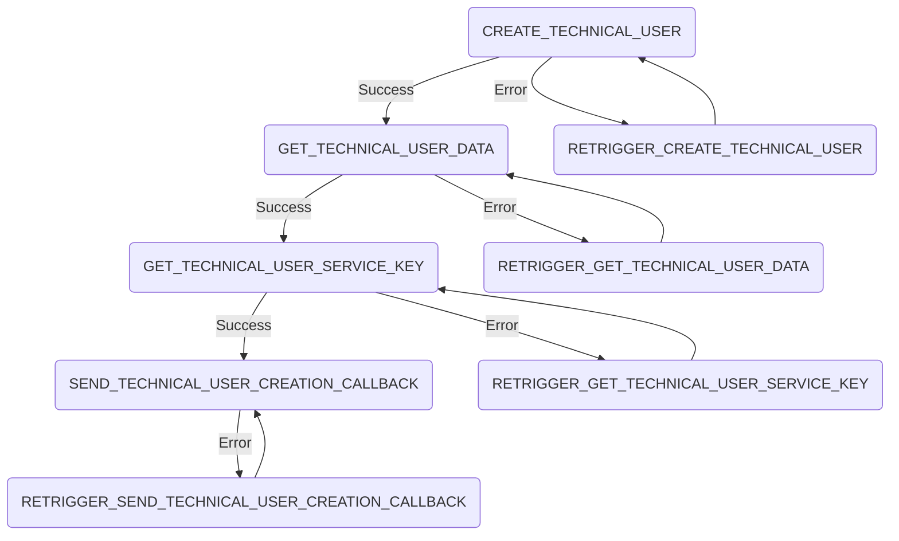

# Create Technical User Process

## Summary

The create technical user process handles the creation of a technical user. The process steps are the following:

## External dependencies

The process worker communicates with the SAP Dim to create the technical user. It further more communicates with the portal backend to return the technical user data.

## Process Steps

### CREATE_TECHNICAL_USER

The process step `CREATE_TECHNICAL_USER` is automatically triggered from the process worker. It sends a request to create the technical user to the SAP Dim.

### GET_TECHNICAL_USER_DATA

The process step `GET_TECHNICAL_USER_DATA` is automatically triggered from the process worker. It requests the status of the operation which is created in the `CREATE_TECHNICAL_USER` step. If the status is `completed` it takes the data of the technical user and saves it in the database.

### GET_TECHNICAL_USER_SERVICE_KEY

The process step `GET_TECHNICAL_USER_SERVICE_KEY` is automatically triggered from the process worker. It retrieves the service key id which is the unique identifier of the technical user in the SAP Dim.

### SEND_TECHNICAL_USER_CREATION_CALLBACK

The process step `SEND_TECHNICAL_USER_CREATION_CALLBACK` is automatically triggered from the process worker. It sends the technical user details to the portal backend.

## Retrigger

| Step Name                             | Retrigger Step                                  | Retrigger Endpoint                                                                                                    |
| ------------------------------------- | ----------------------------------------------- | --------------------------------------------------------------------------------------------------------------------- |
| CREATE_TECHNICAL_USER                 | RETRIGGER_CREATE_TECHNICAL_USER                 | api/dim/process/technicalUser/{processId}/retrigger?processStepTypeId=RETRIGGER_CREATE_TECHNICAL_USER                 |
| GET_TECHNICAL_USER_DATA               | RETRIGGER_GET_TECHNICAL_USER_DATA               | api/dim/process/technicalUser/{processId}/retrigger?processStepTypeId=RETRIGGER_GET_TECHNICAL_USER_DATA               |
| GET_TECHNICAL_USER_SERVICE_KEY        | RETRIGGER_GET_TECHNICAL_USER_SERVICE_KEY        | api/dim/process/technicalUser/{processId}/retrigger?processStepTypeId=RETRIGGER_GET_TECHNICAL_USER_SERVICE_KEY        |
| SEND_TECHNICAL_USER_CREATION_CALLBACK | RETRIGGER_SEND_TECHNICAL_USER_CREATION_CALLBACK | api/dim/process/technicalUser/{processId}/retrigger?processStepTypeId=RETRIGGER_SEND_TECHNICAL_USER_CREATION_CALLBACK |

## NOTICE

This work is licensed under the [Apache-2.0](https://www.apache.org/licenses/LICENSE-2.0).

- SPDX-License-Identifier: Apache-2.0
- SPDX-FileCopyrightText: 2024 SAP SE or an SAP affiliate company, BMW Group AG and ssi-dim-middle-layer contributors
- Source URL: https://github.com/SAP/ssi-dim-middle-layer
