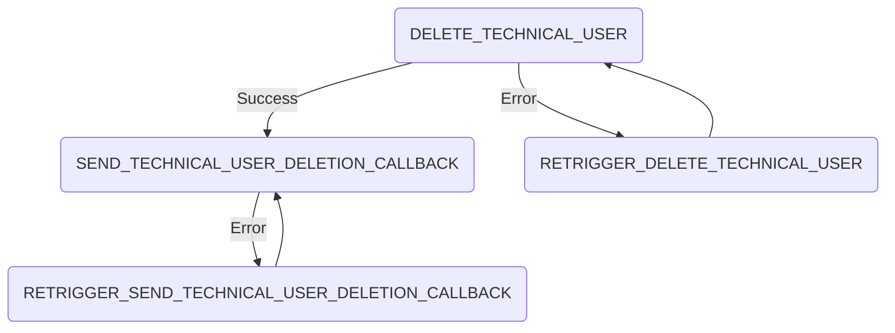

# Delete Technical User Process

## Summary

The delete technical user process handles the deletion of an technical user. The process steps are the following:

## External dependencies

The process worker communicates with the SAP Dim to delete the technical user. It further more communicates with the portal backend to return the status of the deletion.

## Process Steps

### DELETE_TECHNICAL_USER

The process step `DELETE_TECHNICAL_USER` is automatically triggered from the process worker. It sends a request to delete the technical user from the SAP Dim.

### SEND_TECHNICAL_USER_DELETION_CALLBACK

The process step `SEND_TECHNICAL_USER_DELETION_CALLBACK` is automatically triggered from the process worker. It deletes the technical user from the dim database and sends a status update to the portal backend.

## Retrigger

| Step Name                             | Retrigger Step                                  | Retrigger Endpoint                                                                                                    |
| ------------------------------------- | ----------------------------------------------- | --------------------------------------------------------------------------------------------------------------------- |
| DELETE_TECHNICAL_USER                 | RETRIGGER_DELETE_TECHNICAL_USER                 | api/dim/process/technicalUser/{processId}/retrigger?processStepTypeId=RETRIGGER_DELETE_TECHNICAL_USER                 |
| SEND_TECHNICAL_USER_DELETION_CALLBACK | RETRIGGER_SEND_TECHNICAL_USER_DELETION_CALLBACK | api/dim/process/technicalUser/{processId}/retrigger?processStepTypeId=RETRIGGER_SEND_TECHNICAL_USER_DELETION_CALLBACK |

## NOTICE

This work is licensed under the [Apache-2.0](https://www.apache.org/licenses/LICENSE-2.0).

- SPDX-License-Identifier: Apache-2.0
- SPDX-FileCopyrightText: 2024 SAP SE or an SAP affiliate company, BMW Group AG and ssi-dim-middle-layer contributors
- Source URL: https://github.com/SAP/ssi-dim-middle-layer
